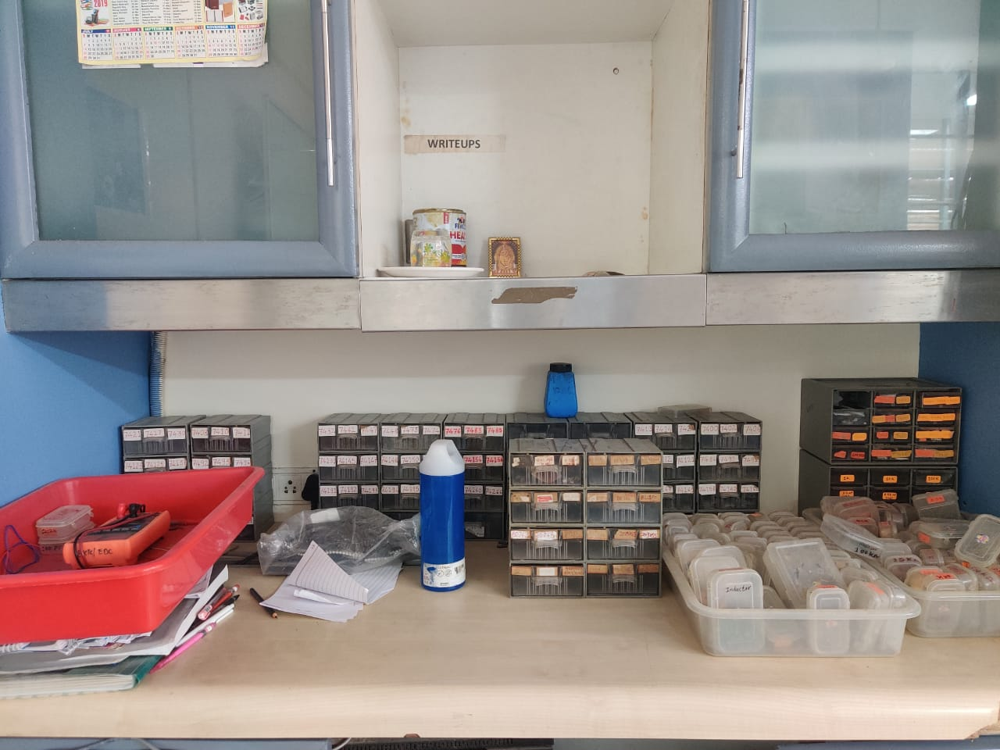
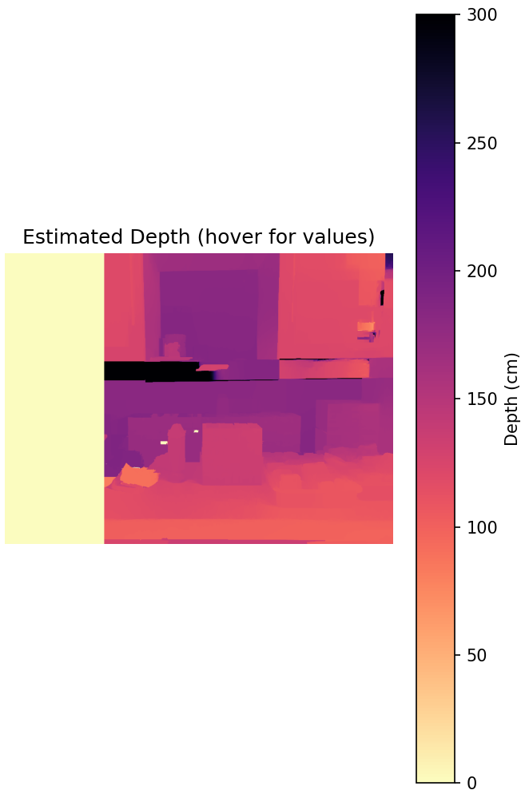
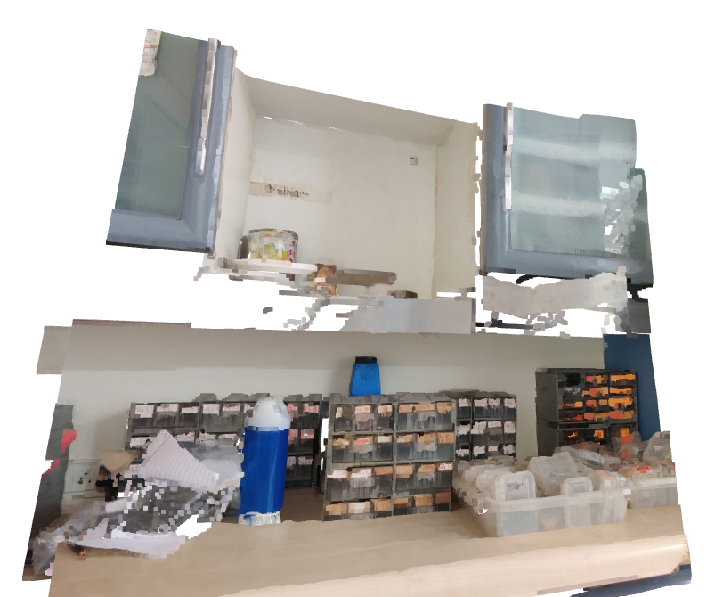

# StereoDepth Engine: Monocular 3D Reconstruction

<div align="center">


**Transform ordinary stereo photos into dense 3D point clouds — no calibration required.**

[Features](#-features) • [Installation](#-installation) • [Usage](#-usage) • [How It Works](#-how-it-works) • [Configuration](#%EF%B8%8F-configuration)

</div>

---

## 🎯 Overview

**StereoDepth Engine** is a complete computer vision pipeline that generates dense depth maps and 3D point clouds from uncalibrated stereo image pairs. Simply take two photos from slightly different positions (like shifting your phone a few centimeters) and let the algorithm reconstruct the 3D structure of your scene.

---

## 📸 Results for `inputs/left_15.jpeg` & `inputs/right.jpeg`

| Left View | Right View |
| :---: | :---: |
|  |  |

### 3D Reconstruction Output

| Depth Map | Point Cloud |
| :---: | :---: |
|  |  |

## ✨ Features

| Feature | Description |
|---------|-------------|
| 📐 **Automatic Rectification** | Optional SIFT feature matching + Fundamental Matrix estimation for handheld images (can skip for tripod captures) |
| 🖼️ **Dense Disparity Mapping** | Implements Semi-Global Block Matching (SGBM) optimized for larger baselines with 3-way mode |
| 🔧 **WLS Filtering** | Applies Weighted Least Squares smoothing to preserve edges while reducing noise |
| � **Interactive 3D Viewer** | Opens an interactive point cloud window with zoom, pan, and tilt controls using Open3D |
| 🖱️ **Depth Hover Display** | Hover your mouse over the depth map to see exact depth values in real-time |
| �🌐 **3D Point Cloud Export** | Generates colored `.ply` files viewable in MeshLab, CloudCompare, or Blender |
| ⚡ **Configurable Pipeline** | Easily tune camera parameters and algorithm settings for your specific hardware |

---

## 🛠️ Installation

### Prerequisites
- Python 3.8 or higher
- pip package manager

### Setup

```bash
# Clone the repository
git clone https://github.com/deevinandu/StereoDepth-Monocular-3DReconstruction.git
cd StereoDepth-Monocular-3DReconstruction

# Create virtual environment (recommended)
python -m venv venv
source venv/bin/activate  # On Windows: venv\Scripts\activate

# Install dependencies
pip install -r requirements.txt
```

### Dependencies
- `numpy` — Numerical computing
- `opencv-contrib-python` — Image processing with SIFT, WLS filter, and stereo algorithms
- `matplotlib` — 2D visualization and interactive depth hover
- `open3d` — Interactive 3D point cloud viewer with zoom/pan/tilt controls

---

## 🚀 Usage

### Quick Start

1. **Place your stereo images** in the project root directory:
   - `left.jpeg` — Left camera position
   - `right.jpeg` — Right camera position (shifted horizontally)

2. **Run the pipeline**:
   ```bash
   python main.py
   ```

3. **View the results**:
   - A matplotlib window will open with the depth map (hover to see depth values)
   - An interactive 3D point cloud viewer will open (use mouse to zoom/pan/rotate)
   - Output is saved to `output.ply`

### Hardcoded Configuration

Image paths are hardcoded in `main.py` (lines 7-9):
```python
LEFT_IMAGE_PATH = r"left.jpeg"
RIGHT_IMAGE_PATH = r"right.jpeg"
OUTPUT_PLY_PATH = r"output.ply"
```

### Interactive Controls

**Depth Map Window:**
- 🖱️ Hover your mouse over any pixel to see its depth value in cm

**3D Point Cloud Viewer:**
- 🖱️ **Left-drag**: Rotate view
- 🔍 **Scroll**: Zoom in/out
- ✋ **Middle-drag** or **Shift+Left-drag**: Pan
- ⌨️ **R**: Reset camera view
- ⌨️ **Q**: Quit viewer

### How To Capture Stereo Pairs

**For Best Results (Tripod Method - Recommended):**
1. **Use a tripod** — Mount camera on tripod for stable, parallel shots
2. **Horizontal shift only** — Move tripod exactly horizontally (current config: 32 cm baseline)
3. **No rotation** — Keep camera perfectly level between shots
4. **Same settings** — Lock focus, exposure, and zoom
5. **Static scenes** — No moving objects

**For Handheld Captures:**
- Set `SKIP_RECTIFICATION = False` in `src/config.py`
- Move camera 5-10 cm horizontally (smaller baseline)
- Update `BASELINE_CM` in config to match your movement
- Results may be less accurate due to hand shake

---

## 🔬 How It Works

### Pipeline Overview

```
┌─────────────┐     ┌─────────────────┐     ┌─────────────────┐     ┌─────────────┐
│  Load Stereo │────▶│   Epipolar      │────▶│    SGBM         │────▶│   Depth     │
│    Images    │     │  Rectification  │     │  Disparity      │     │ Calculation │
└─────────────┘     └─────────────────┘     └─────────────────┘     └──────┬──────┘
                                                                           │
                                                                           ▼
                                                                   ┌─────────────┐
                                                                   │  3D Point   │
                                                                   │ Cloud (.ply)│
                                                                   └─────────────┘
```

### 1. Epipolar Rectification

Since handheld photos are rarely perfectly aligned, we compute the **Fundamental Matrix** from SIFT feature correspondences. Both images are warped so that corresponding points lie on the same horizontal scanlines.

```
Uncalibrated Input → SIFT Matching → Fundamental Matrix → Homography Warping → Aligned Output
```

### 2. Disparity Estimation

We use **Semi-Global Block Matching (SGBM)** to compute pixel-level disparities:

$$\text{Disparity} = x_{\text{left}} - x_{\text{right}}$$

A **WLS (Weighted Least Squares) filter** is applied to smooth the disparity map while preserving sharp object edges.

### 3. Depth Calculation

Depth is recovered via stereo triangulation:

$$Z = \frac{f \cdot B}{d}$$

Where:
- **f** = Focal length in pixels
- **B** = Baseline distance between camera positions
- **d** = Disparity value

---

## ⚙️ Configuration

Edit `src/config.py` to match your setup:

```python
# Camera Intrinsic Parameters
FOCAL_LENGTH_MM = 4.76        # Lens focal length
SENSOR_WIDTH_MM = 6.40        # Physical sensor width
BASELINE_CM = 32.0            # Distance between camera positions (CRITICAL)

# Processing Parameters
TARGET_WIDTH = 1000           # Resize width (affects speed)
SGBM_NUM_DISPARITIES = 256    # Max disparity range (larger for bigger baseline)
SGBM_BLOCK_SIZE = 7           # Matching block size (odd number)

# Rectification Settings
SKIP_RECTIFICATION = True     # Set True for tripod captures, False for handheld

# WLS Filter Parameters
WLS_LAMBDA = 8000.0           # Regularization strength
WLS_SIGMA = 1.5               # Edge sensitivity
```

### Important Notes:

- **`BASELINE_CM`** — Must match your actual camera movement distance (currently 32 cm)
- **`SKIP_RECTIFICATION`** — Set to `True` if using tripod with purely horizontal movement (recommended). Set to `False` for handheld captures
- **`SGBM_NUM_DISPARITIES`** — Must be divisible by 16. Increase for larger baselines

> You can find your phone's focal length and sensor size in the EXIF data of your photos or on [GSMArena](https://www.gsmarena.com/).

---

## 📁 Project Structure

```
StereoDepth-Monocular-3DReconstruction/
├── main.py              # Entry point
├── requirements.txt     # Python dependencies
├── inputs/              # Stereo images 
└── src/
    ├── config.py        # Camera & algorithm parameters
    ├── core.py          # StereoPipeline class (rectification, SGBM, depth)
    └── utils.py         # Image I/O, visualization, PLY export
```

---

## 📊 Output Visualization

Running the pipeline generates:

### 1. Interactive Depth Map Window
- **Left view**: Original/rectified image
- **Disparity map**: Pixel correspondence (WLS filtered)
- **Depth map**: Estimated depth in cm with colorbar
- **🖱️ Hover feature**: Move mouse over depth map to see exact depth values at each pixel

### 2. Interactive 3D Point Cloud Viewer (Open3D)
- **Real-time controls**:
  - Rotate with left mouse drag
  - Zoom with scroll wheel
  - Pan with middle mouse or Shift+Left drag
  - Press `R` to reset view
  - Press `Q` to quit
- **Full-color 3D reconstruction** from your stereo pair

### 3. Exported PLY File (`output.ply`)
- View in external software:
  - [**MeshLab**](https://www.meshlab.net/) — Free, cross-platform
  - [**CloudCompare**](https://www.cloudcompare.org/) — Advanced point cloud processing
  - [**Blender**](https://www.blender.org/) — Import via PLY importer add-on

---

## 🔗 Related Projects

**If you want to process your point cloud further** Check out my ground segmentation project:

👉 [**UAV-3D-PointCloud-Ground-Segmentation-RANSAC**](https://github.com/deevinandu/UAV-3D-PointCloud-Ground-Segmentation-RANSAC)

Use RANSAC plane fitting to separate ground surfaces from objects in your point cloud — perfect for robotics and autonomous vehicle applications.

---

## 🤝 Contributing

Contributions are welcome! Feel free to:
- 🐛 Report bugs via Issues
- 💡 Suggest features
- 🔧 Submit pull requests

---

## 📄 License

This project is licensed under the MIT License — see the [LICENSE](LICENSE) file for details.

---

<div align="center">

</div>